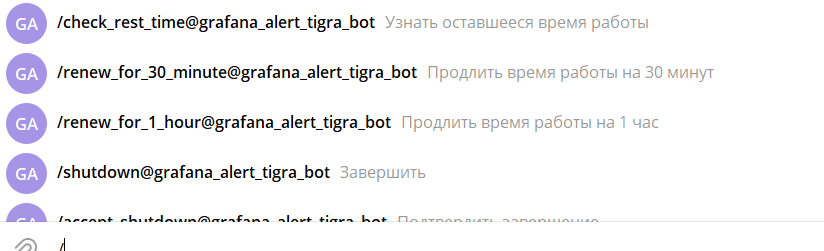

# screener

Скрипт, работающий в фоне. Мониторит нажатие клавиши (например колесико мышки)
и отсылает скрин экрана в telegram или ВКонтакте.

## Быстрый запуск
Готовый `.exe` можно найти в папке [builds](./builds/) (рекомендую последнюю версию). Там лежат все сборки с инструкциями по использованию.

## Как работает

- Скрипт отсылает скрин экрана в чат мессенджера через бота по нажатию на колесико мыши.
- Поддерживаемые мессенджеры: **Telegram** и **ВКонтакте** (выбирается через `"screener"` в конфиге).
- Скрипт использует конфиг в виде `config.json` файла, который обязательно должен
лежать в одной папке со скриптом, со следующими обязательными полями
(необязательные поля можно посмотреть [здесь](./docs/all_settings.md)):
    - `screener` — какой мессенджер использовать для скринов (по умолчанию `"telegram"`, еще есть `"vk"`)
    - `printer` — какой принтер использовать для логов (по умолчанию `"telegram"`, еще есть `"vk"`, `"console"`, `"window"`)
    - если screener = `"telegram"`
      - `bot_token` — (str) токен Telegram-бота (в формате `0000000:aaaaaaa...`)
      - `chat_id` — (str) id чата в Telegram (может быть отрицательным)
    - если screener = `"vk"`
      - `vk.token` — (str) токен сообщества ВКонтакте (в формате vk1.a.XXXXXXXXXXXXXX...)
      - `vk.peer_id` — (int) peer_id беседы ВКонтакте (если создавали чат в сообществе, то 2000000001)


## Как настроить Telegram бота
- Создать бота
    - Написать Telegram боту `@BotFather`: `/newbot`
    - Ввести имя нового бота
    - Ввести логин нового бота
    - Получить от `@BotFather` его токен
- Создать чат (не канал) и добавить в него бота
- Узнать id чата:
    - Добавить в созданный чат `@get_my_chat_id_bot`, он сразу напечатает id чата; при изменении кол-ва участников он напечатает новый chat_id
    - Либо вставить в адресную строку браузера `https://api.telegram.org/bot<TOKEN>/getUpdates`, нажать enter, в полученном результате найти `"chat" -> "id"`

**!!! После изменения кол-ва участников чата chat_id может измениться**

## Как настроить бота ВКонтакте

- Создать сообщество ВКонтакте (Сообщества → Создать сообщество)
- В разделе Управление → Дополнительно → «Работа с API» → «Создать ключ» получить
токен с правом на сообщения и фотографии
- В разделе Управление → Чаты → Создать чат
- По клику на чат скопиурйте ссылку вступления в формате
https://vk.me/join/XXXXXXXXXXXXXXXXXXXX= и вступите в чат
- `peer_id` в этом чате будет 2000000001 (тк это первый чат сообщества)

## Как можно использовать

### Запуск
Исполняемый файл (.exe) можно запустить прямо с флешки не загружая его
на рабочий стол. Вставив флешку нужно запустить файл, подождать около 10 секунд
на загрузку программы в оперативную память и запуск. После этого проверить, что
скрины отправляются и вынуть флешку.

### Во время работы

#### Команды

Программой можно управлять через команды в Telegram (пока нет поддержки управления для ВК):




## Как собрать .exe файл для Windows (для разработки новых версий)
- Установить pyinstaller
    ```
    pip install pyinstaller
    ```
- Собрать .exe файл
    ```
    pyinstaller src\main.py -F -w
    ```
    - флаг `-F` — чтобы приложение собралось в один файл
    - флаг `-w` — говорит о том, что приложение оконное (не будет создаваться терминал при запуске)
